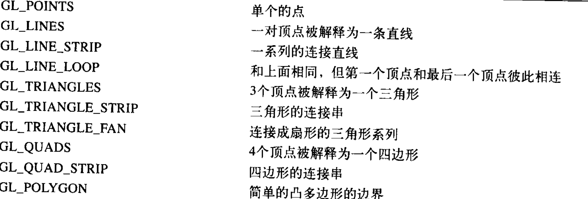
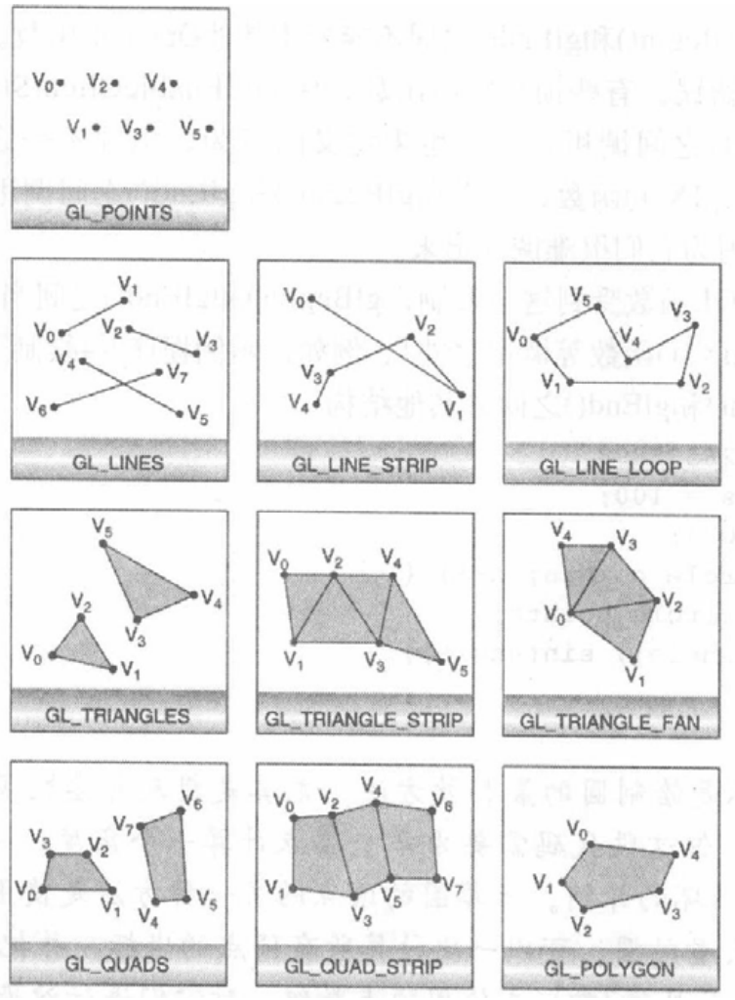

#  第二章

绘制基本分为：清屏、绘制及和图形、绘制光栅。光栅包括二维图形、位图、字体之类的东西。

在绘制的过程中，如果没有特殊指定，每次调用绘制函数的时候，指定物体就会被绘制，在绘制之前需要列出它们的清单。这里就有两个概念:**立即绘制模式**

## 绘制工具箱

介绍如何清除窗口，绘制图形 如何设置颜色  和   强制绘制。

### 清除窗口

绘制之前需要清除颜色，如果绘制的墙面在绘制的时候会将前一帧全部绘制，可以不需要清屏。

**问题1：为什么使用清屏，而不是一个巨大的矩形将绘制区域占满呢？**

- 因为清除窗口函数的效率远比普通绘制的效率高。
- 可以在任意地方的任意大小的地方绘制，所有矩形的大小是多大，在什么位置就不知道了。
- 缓冲区是有许多个的，不是只有一个，清屏可以清除掉所有的，比较方便。

**问题2：颜色表示方式**

- 使用RGBA
- 使用颜色索引值

举例：

```java
glClearColor(0,0,0,0);
glClear(GL_COLOR_BUFFER_BIT);
```

这个知识清除颜色缓存区。

```java
glClearDepth(1.0);//每个像素的值设置为1.0
```

**问题3：缓存区有哪些?**

- 颜色缓存区

  ```java
  glClearColor();
  ```

- 深度缓存区

  ```java
  glClearDepth();
  ```

- 累计缓存区

  ```java
  glClearAccum();
  ```

  

- 模板缓存区

  ```java
  glClearStencil()
  ```

  

几个缓存区不适应默认的值，那么就需要将单独的设置值

### 指定颜色

绘制的时候使用当前指定的颜色进行绘制

设置颜色：

```java
glColor3f(1.0,1.0,1.0);
```

### 强制绘制

绘制就像一条流水线，cpu发出指令之后，就等待执行结束，绘制到屏幕上。

glFlush（）可以进行强制执行刷新，一般在 指定时间内执行

对于同步执行可以使用glFinsh()

### 坐标工具箱


## 描述点/直线/多边形 

描述openGL图元的基本图元 ，图元都是根据它们的顶点来进行描述的，在openGL中使用的是float类型的数据，数据是存在四舍五入 的，所有也会存在误差。它的单位是像素，所有会存在略微不同的点，可能把它们绘制在同一个点上。

**多边形：**内部可以被填充，也可以绘制它的边框，甚至点的形式。一般地，多边形比较的复杂，所以会将其施加很多的限制，比如各个边不可以相交，必须是凸边形。

简单多边形好实现，但是复杂的就很难了，所以多边形都是简单的多边形。

**矩形：**openG存在矩形，但是在open gl es中是不存在的。

**曲面和弯曲表面：**通过短小的进行拼接

### 指定顶点

x,y,z,w  默认z=0,w=1

### 图元几何

- 单个点：GL_POINTS
- 直线：GL_LINES






## 其他

齐次坐标：三维投影根基齐次坐标进行的，xyzw  默认情况下w的值为1.

