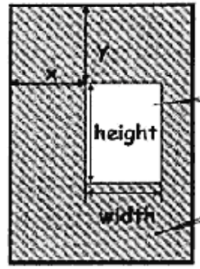

# 投影和变换

2.0之后，可以自己的进行变换。

## 摄像机的位置

摄像机姿态和位置不同，得到的画面也不同。摄像机包括位置，观察方向，up的位置。

相机的设置

```java
Matrix.setLookAtM(vv,0 ,px,py,pz,tx,ty,tz,ux,uy,uz);
```

##  两种投影

将3D世界投影到二维平面上，有正交和透视两种。

### 正交投影

管线会通过投影确定一个可视区域，包括up/down/left/right/far/near

范围内的可以看到，然后将其金瓶梅内容显示到屏幕上。正交投影不会出现近小远大的效果。

设置：

```java
Matrix.orthcM(
	mProjMatrix,
    0,
    left,right,
    bottom,top,
    near,far
);
```

图形最后会显示在近平面上，显示在视口上

```java
glViewport(x,y,width,hight);
```



一般的使得近平面的left+right / top + bottom(不就是宽/高吗) == width / hight


